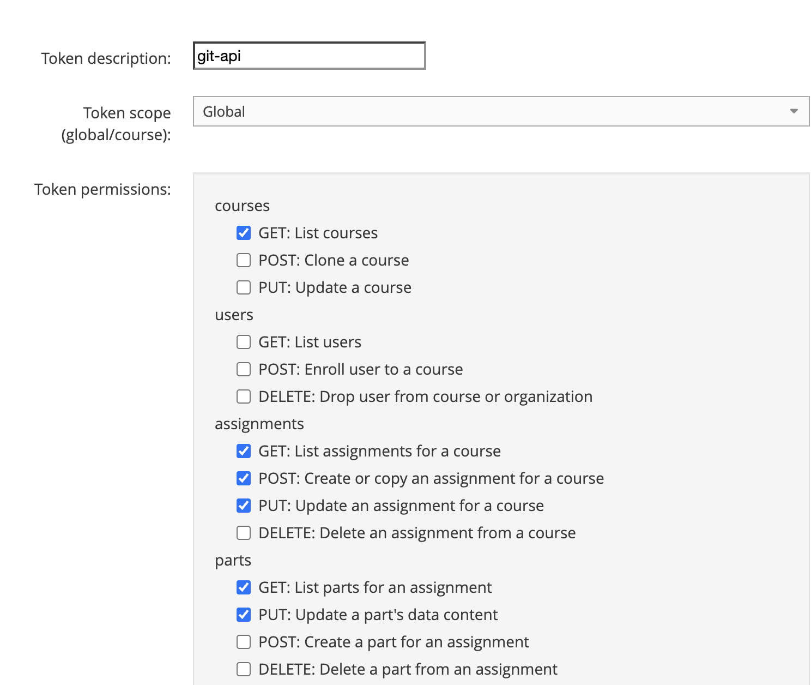
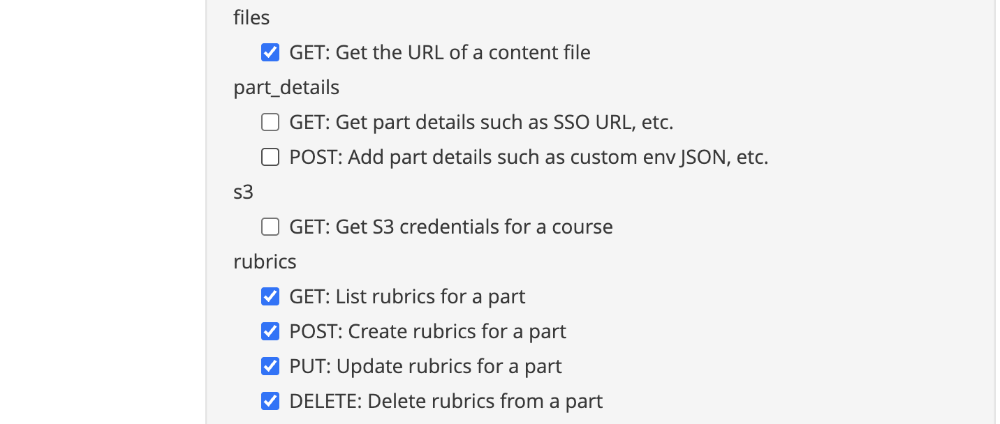

# Vocareum Publisher

Push assignment content from GitHub to Vocareum.

A CLI tool and GitHub Action that enables instructors to maintain assignment content in Git with full version control while seamlessly syncing to Vocareum.

Current stable release in this repository:
- CLI package: `vocareum-publisher@1.0.12`
- VS Code extension: `vocgit@1.0.1`

**[Video Walkthrough](https://www.loom.com/share/2af5f925c0244db0bf9825f8e7e133bd)** - Watch a quick demo of vocgit in action.

## Features

- **Git-First Workflow**: GitHub is the source of truth for all assignment content
- **CLI Tool**: Local development and push via command line
- **GitHub Action**: Automated CI/CD push on git push
- **Change Detection**: Only uploads changed content (efficient)
- **Template-Based Creation**: Create new assignments from templates
- **Validation**: Verify configuration before pushing

## Installation

```bash
npm install -g vocareum-publisher
```

## Quick Start

### 1. Initialize a Course Repository

```bash
mkdir my-course && cd my-course
git init
vocgit init
```

### 2. Create an Assignment

```bash
vocgit new lab1-intro
# Follow interactive prompts
```

### 3. Add Content

Add your files to the generated directory structure:

```
lab1-intro/
├── part1/
│   ├── startercode/   # Student-visible starter code
│   ├── scripts/       # Grading scripts
│   ├── docs/          # Documentation
│   ├── data/          # Datasets
│   └── private/       # Private files
```

`vocgit new` scaffolds one part (`part1`) with default directories:
`startercode`, `scripts`, `docs`, `data`, and `private`.
If needed, add `lib` and `asnlib` manually and include them in `parts[].directories`.

### 4. Validate and Push

```bash
vocgit validate
vocgit push
```

### 5. Commit and Push

```bash
git add .
git commit -m "Add Lab 1"
git push
```

## Configuration

All configuration is stored in `vocareum.yaml`:

```yaml
version: "1.0"

vocareum:
  org_id: "12345"
  course_id: "67890"
  templates:                        # Named templates for creating new assignments
    - id: "99999"
      name: "Standard Lab"
      course_id: "67890"            # Same course
    - id: "88888"
      name: "Cloud Lab"
      course_id: "11111"            # Template in different course
    - id: "77777"
      name: "Timed Exam"
      course_id: "67890"
  excluded_assignments:       # Assignment IDs to hide from orphan detection
    - "111222"
    - "333444"
  course_settings:            # Optional course metadata sync
    name: "Intro to ML"
    description: "Spring section"

assignments:
  - assignment_id: "11111"
    name: "Lab 1: Introduction"
    path: "lab1-intro"
    settings:                       # Optional assignment settings
      description: "Introduction to the course"
      nosubmit: false
      publish: true
      auto_submit: false
      grading_on_submit: true
      exam_mode: "timed"            # timed, scheduled, or timed_scheduled
      exam_duration: 120
      num_attempts: 3
    parts:
      - part_id: "22222"
        path: "part1"
        name: "Part 1: Setup"
        settings:                   # Optional part settings
          submission_filters:
            include: ["*.py"]
            exclude: ["*.pyc"]
          session_length: "60"      # minutes
          late_penalty_percent: 10
          late_penalty_percent_rule: "max score"  # or "student score"
          deadlinedate: "2025-03-15T23:59:00Z"
          number_of_submissions: 5
          lab_interface:
            panels: ["Console"]
            controls: ["Reset"]
  - assignment_id: null
    name: "Lab 2: Classification"
    assignment_name_for_lookup: "Lab 2: Classification"  # Optional name-based ID discovery
    path: "lab2-classification"
    parts:
      - part_id: null
        path: "part1"
        name: "Part 1: Implementation"
        settings:
          cloud_labs: true
          session_length: "60"
          labtype: "JupyterLab"
          endlab: "stop"            # or "terminate"

publish_options:
  on_missing_id: "skip"
  auto_commit: false
  sync_deletes: false

publish_history:
  - timestamp: "2026-02-12T22:30:00Z"
    commit_sha: "abc123def456"
    published_by: "github-actions"
    status: "failed"   # success | failed
    content_state:
      "lab1-intro/part1/startercode": "9a7f..."
    failed:
      - type: "file"
        id: "22222/startercode/main.py"
        error: "Timed out after 30000ms waiting for part update (txn=123)"
```

## CLI Commands

| Command | Description |
|---------|-------------|
| `vocgit init` | Initialize a new course repository |
| `vocgit new <path>` | Create new assignment structure |
| `vocgit validate` | Validate configuration and structure |
| `vocgit fix` | Interactively fix validation issues |
| `vocgit pull` | Import or exclude orphaned assignments from Vocareum |
| `vocgit status` | Show current local sync status (default command) |
| `vocgit push` | Push content to Vocareum |

```bash
vocgit                  # Same as: vocgit status
vocgit status --verbose # Include per-assignment details
```

### Push Options

```bash
vocgit push --dry-run           # Preview changes
vocgit push --assignment lab1   # Push specific assignment
vocgit push --force-all         # Re-upload everything
vocgit push --sync-deletes      # Delete files not in Git (experimental)
vocgit push --non-interactive   # Skip confirmation prompt
vocgit push --verbose           # Detailed logging
```

### Pull Command

The `pull` command helps you manage assignment sync issues:

1. **Orphaned assignments** - exist in Vocareum but not in your local config
2. **Stale assignments** - exist in your config but were deleted from Vocareum
3. **Settings drift** - settings in Vocareum differ from your local config
4. **Content drift** - files in Vocareum differ from your local files

This is useful when:
- You've created assignments directly in the Vocareum UI
- You're onboarding an existing course to Git-based management
- Assignments were created or deleted by another team member
- Settings were changed in Vocareum UI and you want to sync them locally
- Files were edited directly in Vocareum and you want to pull those changes

```bash
vocgit pull                # Interactive mode
vocgit pull --verbose      # Show detailed output
vocgit pull --non-interactive  # Skip all issues
```

**For orphaned assignments** (in Vocareum, not in config):
- **Import**: Download content and add to your local repository
- **Exclude**: Hide from future scans (add to `excluded_assignments`)
- **Skip**: Do nothing

**For stale assignments** (in config, deleted from Vocareum):
- **Reset ID**: Clear assignment_id to allow re-creation from template
- **Remove**: Delete the assignment from config entirely
- **Exclude**: Keep in config but skip during sync
- **Skip**: Do nothing

**For settings drift** (local settings differ from Vocareum):
- **Pull**: Update local config with settings from Vocareum
- **Keep**: Keep local settings (will overwrite Vocareum on next push)
- **Skip**: Do nothing for now

**For content drift** (files in Vocareum differ from local):
- **Pull**: Download remote files (overwrites local files)
- **Keep**: Keep local files (will overwrite Vocareum on next push)
- **Skip**: Do nothing for now

Example workflow:

```
$ vocgit pull

ℹ Scanning for assignment sync issues...
ℹ Found 1 orphaned assignment(s) in Vocareum.

[1/1] Lab 3: Advanced Topics (ID: 555666)
? What would you like to do? Import to local repository
? Local directory name: lab3-advanced
  Part 1/2: downloaded 5 files
  Part 2/2: downloaded 3 files
✓ Imported "Lab 3: Advanced Topics" to lab3-advanced/

ℹ Found 1 stale assignment(s) in config (deleted from Vocareum).

[1/1] Old Lab (ID: 777888, path: old-lab)
? This assignment was deleted from Vocareum. What would you like to do?
  Reset ID (allow re-creation from template)
✓ Reset ID for "Old Lab" - will be re-created on next push

ℹ Found 1 assignment(s) with settings drift.

[1/1] Lab 1: Introduction (ID: 11111)
  Part "Part 1" settings changed:
    - session_length: "60" → "120"
    - cloud_labs: false → true
? What would you like to do? Pull settings from Vocareum (update local config)
✓ Will update local settings for "Lab 1: Introduction"

ℹ Found 1 assignment(s) with content changes on Vocareum.

[1/1] Lab 2: Data Analysis (ID: 22222)
  Content changes:
    ~ docs/README.md (modified)
    + scripts/new_test.py (new on remote)
? What would you like to do? Pull remote files (overwrite local)
✓ Pulled content changes for "Lab 2: Data Analysis"

Summary:
  Imported:        1
  Settings pulled: 1
  Content pulled:  1
  Excluded:        0
  Removed:         0
  Reset:           1
  Skipped:         0

ℹ Updated vocareum.yaml
```

## GitHub Action

```yaml
name: Push to Vocareum
on:
  push:
    branches: [main]
    paths: ['lab*/**', 'vocareum.yaml']

jobs:
  push-to-vocareum:
    runs-on: ubuntu-latest
    steps:
      - uses: actions/checkout@v4

      - name: Push to Vocareum
        uses: ddlin/vocareum-publisher@v1
        with:
          config-file: vocareum.yaml
          api-key: ${{ secrets.VOCAREUM_API_KEY }}
          non-interactive: true
```

Supported action inputs in `action/action.yml`: `config-file`, `api-key`, `dry-run`, `non-interactive`, `assignment`, `part`, `force-all`, `sync-deletes`, `auto-commit`, `verbose`.

## Directory Structure

```
course-repo/
├── vocareum.yaml         # Configuration
├── lab1-intro/
│   └── part1/
│       ├── startercode/  # Student-visible starter code
│       ├── scripts/      # Grading scripts
│       ├── lib/          # Grading libraries (hidden)
│       ├── asnlib/       # Assignment libraries
│       ├── docs/         # Documentation
│       ├── data/         # Datasets
│       └── private/      # Private files
└── lab2-analysis/
    └── ...
```

### Supported Directory Types

| Directory | Description | Synced |
|-----------|-------------|--------|
| `startercode` | Student-visible starter files | ✓ |
| `scripts` | Grading and setup scripts | ✓ |
| `lib` | Grading libraries (hidden from students) | ✓ |
| `asnlib` | Assignment libraries | ✓ |
| `docs` | Documentation files | ✓ |
| `data` | Datasets and resources | ✓ |
| `private` | Private course files | ✓ |
| `course` | Course-level shared files | ✗ |

> **Note:** The `course` directory is NOT synced. It contains course-wide shared files (symlinks) that are shared across all assignments. Syncing these would cause infinite update loops. Manage course-level files directly in the Vocareum UI.

Configure which directories to sync per part:

```yaml
parts:
  - part_id: "123"
    path: "part1"
    directories: ["startercode", "scripts", "lib"]  # Only sync these
```

## Important Notes

### All IDs Are Strings

Vocareum API returns all IDs as strings. Always use string types:

```yaml
# Correct
assignment_id: "12345"

# Wrong
assignment_id: 12345
```

### Local Creation, CI/CD Updates

- **Create assignments locally** using `vocgit new`
- **Commit IDs** to Git before CI/CD runs
- **CI/CD only updates** existing assignments

### Template Selection

Templates can exist in any course within your organization. When you have multiple templates configured, `vocgit new` will prompt you to select which template to use:

```
$ vocgit new lab3
Multiple templates available.
? Select template for this assignment:
❯ Standard Lab (99999)
  Cloud Lab (course:11111, id:88888)
  Timed Exam (77777)
```

Templates in the same course as your main `course_id` show just the ID. Templates in different courses show both the course and assignment ID for clarity.

The selected template ID is stored per-assignment in `vocareum.yaml`:

```yaml
assignments:
  - name: "Lab 3"
    path: "lab3"
    template_assignment_id: "88888"  # Selected: Cloud Lab
```

### Never Auto-Commit in CI/CD

The `auto_commit` option should only be used locally. In CI/CD it is force-disabled by the CLI.

### Push Confirmation Behavior

- Local CLI prompts for confirmation before executing push.
- `--non-interactive` skips prompts.
- CI/GitHub Actions automatically run non-interactive.

### API Contract Notes

- Authentication header: `Authorization: Token <token>`
- Base API path: `https://api.vocareum.com/api/v2/`
- Assignment copy: `POST /api/v2/courses/{courseId}/assignments` with body:
  - `{ "method": "copy", "source": "<templateAssignmentId>", "name": "<newName>" }`
  - Polls transaction endpoint for up to 60 seconds until complete
- Content updates: part `PUT` with `content[].zipcontent` (base64 zip)
  - Uses `reset: 1` to clear directory before upload (ensures exact Git state)
  - All files in directory uploaded together as a single ZIP
- Part updates may return `transactionid`; CLI polls `GET /api/v2/transaction/{id}`
- Failed push runs are stored in `publish_history` with `status: failed` and `failed[]` entries

### ID Discovery

When an assignment or part ID is missing from config but exists in Vocareum:
- Assignment IDs are discovered by name lookup (prevents duplicate creation)
- Part IDs are discovered by seqnum mapping
- Discovered IDs are automatically saved to `vocareum.yaml`

## API Credentials

To use vocgit, you need a Vocareum Personal Access Token with the appropriate permissions.

### Generating a Token

1. Log in to [Vocareum Labs](https://labs.vocareum.com)
2. Go to **Profile > Settings > Personal Access Tokens**
3. Click **Generate New Token**
4. Enter a description (e.g., "git-api")
5. Set **Token scope** to **Global**
6. Select the required permissions (see below)
7. Click **Generate** and copy the token immediately (it won't be shown again)

### Required Permissions

Select the following permissions when creating your token:

| Category | Permissions | Notes |
|----------|-------------|-------|
| **courses** | GET: List courses | |
| **assignments** | GET: List assignments for a course | |
| | POST: Create or copy an assignment for a course | |
| | PUT: Update an assignment for a course | |
| **parts** | GET: List parts for an assignment | |
| | PUT: Update a part's data content | |
| **files** | GET: Get the URL of a content file | |
| **rubrics** | GET, POST, PUT, DELETE | Optional (future feature) |

All other permissions are optional.




### Storing Your Token

**For local CLI use:**
```bash
export VOCAREUM_API_KEY="your-token-here"
```

Or add to your shell profile (`~/.bashrc`, `~/.zshrc`).

**For GitHub Actions:**
1. Go to your repository's **Settings > Secrets and variables > Actions**
2. Click **New repository secret**
3. Name: `VOCAREUM_API_KEY`
4. Value: Your token

## Environment Variables

| Variable | Description |
|----------|-------------|
| `VOCAREUM_API_KEY` | API key for authentication (supported) |
| `VOCAREUM_API_TOKEN` | API key for authentication (supported alias) |
| `VOCAREUM_LOG_LEVEL` | Log level: ERROR, WARN, INFO, DEBUG, TRACE |

## License

MIT License - see [LICENSE](LICENSE) for details.

## Links

- [Documentation](docs/)
- [Examples](examples/)
- [Vocareum API](https://documenter.getpostman.com/view/6736336/S11Exg4b)
- [Issues](https://github.com/ddlin/vocareum-publisher/issues)
